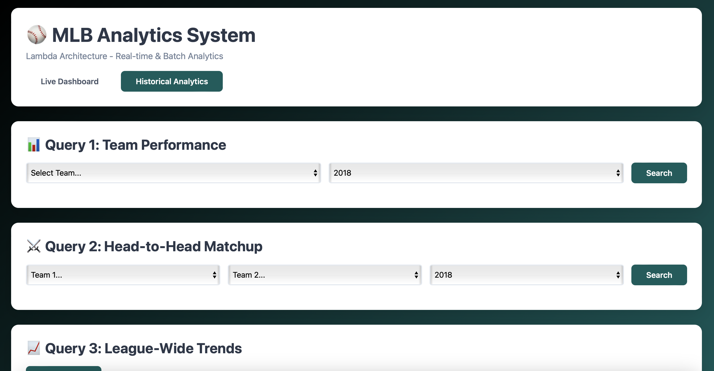
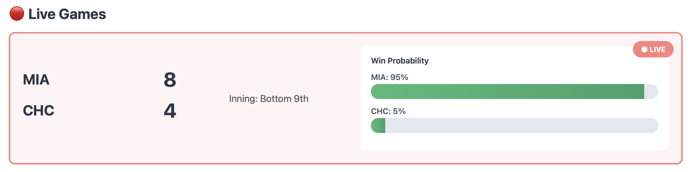
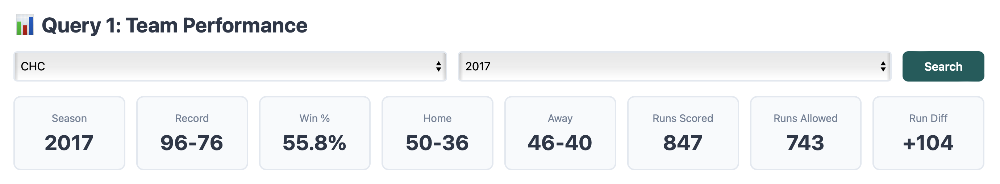
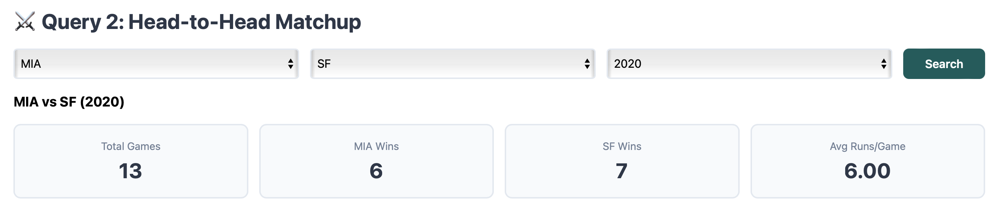
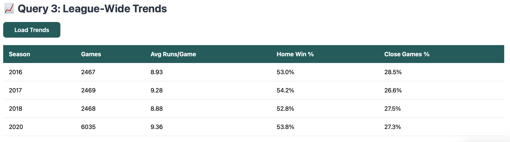

# ⚾🏟️ MLB Analytics System 



A full-stack big data application that simulates **real-time MLB game streaming**, performs **historical analytics**, and displays everything on a web dashboard.

**Github Repo**: 

**Web App**: http://ec2-52-20-203-80.compute-1.amazonaws.com:3025

**Demo Video**: 

This project implements a **Lambda Architecture** using:

- **Kafka** → Real-time streaming ingestion  
- **Spark Streaming** → Real-time processing & predictions  
- **HBase** → Speed layer storage  
- **Hive / HDFS** → Batch layer historical analytics  
- **Flask + SSH tunneling** → API & visualization layer  
- **EC2 Deployment** → Web server hosting

## System Architecture
```text
                      ┌─────────────────────────────────────────────────────────────────┐
                      │                        DATA SOURCES                             │
                      │                  games.csv + events.csv                         │
                      └──────────────────────────────────────────────────────────────── ┘
                                                      │
                                        ┌─────────────┴──────────────┐
                                        │                            │
                                ┌───────▼────────┐          ┌────────▼────────┐
                                │  BATCH LAYER   │          │  SPEED LAYER    │
                                │                │          │                 │
                                │  • HDFS        │          │  • Kafka        │
                                │  • Hive        │          │  • Spark        │
                                │  • Spark Batch │          │    Streaming    │
                                │                │          │  • HBase        │
                                │  Historical    │          │  Live           │
                                │  Analysis      │          │  Games          │
                                └───────┬────────┘          └────────┬────────┘
                                        │                            │
                                        └─────────────────────────── ┘
                                                       │
                                               ┌───────▼────────┐
                                               │ SERVING LAYER  │
                                               │                │
                                               │ • Flask API    |
                                               │ • HBase API    | 
                                               │ • Web Dashboard│
                                               └────────────────┘
```

## Project Components
**1. Data Sources**
- MLB dataset from https://www.retrosheet.org/downloads/csvdownloads.html
- Files used:
  - `games.csv`
  - `events.csv`

**2. Batch Layer (Hive + Spark)**

**2.1 Storage**
- HDFS for raw and transformed data  
- Hive warehouse for analytical tables

**2.2 Hive Tables**
| Table Name | Description |
|------------|-------------|
| `games` | Game-level metadata |
| `events` | Per-play event logs |
| `team_season_stats` | Team aggregated stats |
| `matchup_stats` | Head-to-head results |
| `league_trends` | League-wide seasonal trends |

**2.3 Spark Processing**
- Loads Hive tables
- Computes:
  - Win/loss records
  - Run differential
  - Matchup outcomes
  - League trends

**3. Speed Layer (Kafka → Spark Streaming → HBase)**

**3.1 Kafka Producer**

Simulates real-time games by streaming historical events: `game_id`, `inning`, `event_id`, `event_description`, `away_score`, `home_score` → into Kafka topic: `mlb-game-events`

**3.2 Spark Streaming Pipeline**
1. Reads events from Kafka  
2. Extracts features:
   - `inning number`
   - `score differential`  
   - `late-game flag`  
3. Runs **Rule-based prediction model** for win probability  
4. Writes to HBase table

**3.3 Rule-based prediction model**

This model uses a small set of deterministic rules based on baseball game logic:
- Score Differential Rule
  - If `home_score` > `away_score` → higher home win probability
  - If `home_score` < `away_score` → higher away win probability
- Late Game Weighting
  As the inning increases, the leading team's win probability becomes more decisive:
  ```bash
  if inning >= 7:
    weight = 0.75
  else:
    weight = 0.55
   ```
- Late Game Weighting
  - In early innings: probabilities remain near 0.50
  - In late innings: slight advantage given to home team (home-field advantage)

**3.4 HBase Schema**
| Column Family | Columns |
|---------------|---------|
| `prediction` | `home_win_prob`, `away_win_prob` |
| `game_state` |  `inning`, `home_team`, `away_team`, `home_score`, `away_score` |

Row Key Format: <game_id>_<event_number>


**4.Serving Layer (Flask API + Frontend)**

The web app provides:

**4.1 Live Dashboard**

- Real-time game state
- Live probability updates
- Inning + score tracking

**4.2 Historical Analytics**

**Query 1: Team Season Stats**

- Wins / Losses
- Win percentage
- Home vs Away performance
- Runs scored / allowed

**Query 2: Head-to-Head Matchups**

- Team1 vs Team2
- Win counts
- Avg runs per game

**Query 3: League Trends**

- Avg runs/game per season
- Home win rate
- Close games % (run diff ≤ 1)

## Deployment Guide (EC2)
**1. Upload App**
```bash
scp -i ~/.ssh/key -r francyhsu_app ec2-user@<webserver>:/home/ec2-user/
```
**2. Start Flask App**
```bach
cd francyhsu_app
python3 -m venv venv
source venv/bin/activate
pip install -r requirements.txt
pm2 start app.py --name francy_app
pm2 save
```
**3. Start HBase API**
```bash
nohup python3 hbase_api.py > hbase_api.log 2>&1 &
```
**4. SSH Tunnel to HBase**
```bash
ssh -i ~/.ssh/key -N -L 9090:localhost:9090 hadoop@<cluster-host>
```
**5. Run Spark streaming**
```bash
/usr/lib/spark/bin/spark-submit \        
  --packages org.apache.spark:spark-sql-kafka-0-10_2.12:3.5.6 \
  --master yarn \
  spark_streaming_fixed.py
```
**6. Run Kafka producer**
```bash
python3 kafka_producer.py
```
**7. Test APIs**
```bash
curl http://<webserver>:3025/api/teams
curl http://<webserver>:3025/api/live-games
curl http://localhost:5001/api/hbase/live-predictions
``` 
## Data Flow Summary
Batch Flow
```text
CSV → HDFS → Hive Tables → Spark Batch Jobs → Aggregated Tables
```
Speed Flow
```text
Events → Kafka → Spark Streaming → XGBoost Prediction → HBase → Flask → Dashboard
```

## Author
Francy Hsu

Master’s Student, University of Chicago MPCS

Course: Big Data Application Architecture (MPCS 53014-1)

Date: December 2024
